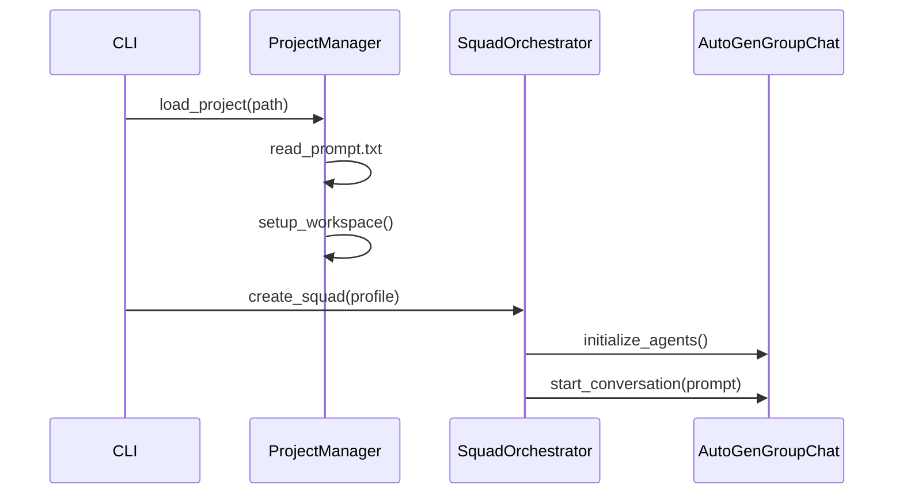
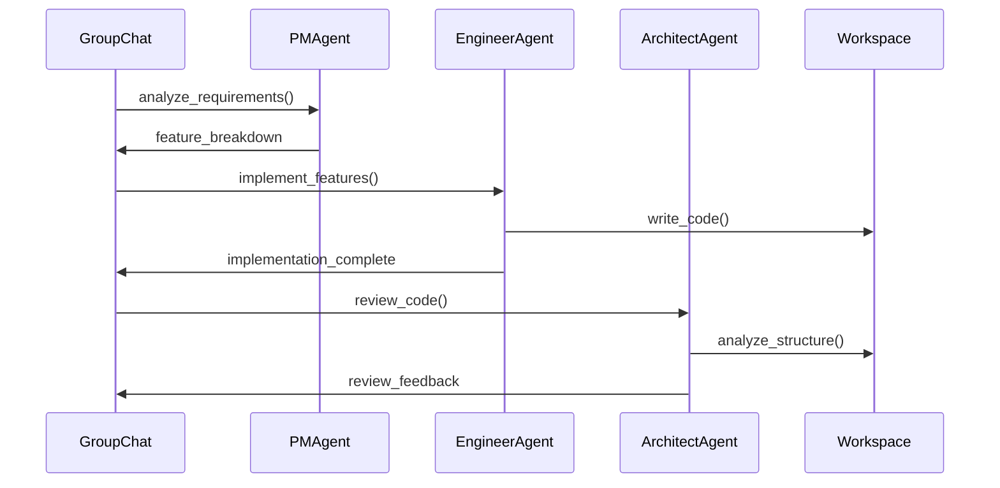

# 🏗️ AutoSquad Architecture

## Overview

AutoSquad is built as a specialized orchestration layer on top of Microsoft's AutoGen framework. This document outlines the technical architecture, design patterns, and integration strategies.

## 🧱 System Architecture

```
┌─────────────────────────────────────────────────────────────┐
│                    AutoSquad Layer                          │
├─────────────────────────────────────────────────────────────┤
│  CLI Interface  │  Project Manager  │  Squad Orchestrator   │
├─────────────────────────────────────────────────────────────┤
│              Agent Specialization Layer                     │
│  Engineer Agent │  Architect Agent  │  PM Agent │ QA Agent  │
├─────────────────────────────────────────────────────────────┤
│                    AutoGen Foundation                       │
│  AgentChat API  │  Core Messaging   │  Extension System     │
│  Group Chat     │  ConversableAgent │  Tool Integration     │
└─────────────────────────────────────────────────────────────┘
```

## 🔧 Core Components

### 1. AutoGen Integration Layer

**Purpose**: Bridge between AutoSquad concepts and AutoGen primitives

**Key Classes**:

- `BaseSquadAgent(ConversableAgent)`: Enhanced AutoGen agent with project awareness
- `SquadGroupChat(GroupChat)`: Custom group chat with development workflow logic
- `ProjectWorkspace`: File system abstraction for agent workspace management

**AutoGen APIs Used**:

- `autogen-agentchat`: For multi-agent conversations and group coordination
- `autogen-core`: For message passing and event handling
- `autogen-ext`: For LLM client management and tool integration

### 2. Squad Orchestration Engine

**Purpose**: Manage the development workflow and agent coordination

```python
# High-level orchestration flow
class SquadOrchestrator:
    def __init__(self, config: SquadConfig, project: Project):
        self.agents = self._create_agents(config.squad_profile)
        self.group_chat = SquadGroupChat(agents=self.agents)
        self.project = project
    
    async def run_development_cycle(self, rounds: int):
        # Initialize project context
        await self._setup_project_workspace()
        
        # Collaborative development rounds
        for round_num in range(rounds):
            await self._run_round(round_num)
            await self._reflect_and_plan()
        
        # Finalize and package results
        await self._generate_final_artifacts()
```

### 3. Agent Specialization Framework

**Purpose**: Define role-specific behaviors while leveraging AutoGen's capabilities

```python
class BaseSquadAgent(ConversableAgent):
    def __init__(self, name, role_config, project_workspace):
        super().__init__(name=name, **role_config.autogen_config)
        self.role = role_config.role_type
        self.workspace = project_workspace
        self.tools = self._setup_tools(role_config.tools)
    
    async def process_message(self, message):
        # Add project context and role-specific processing
        enhanced_message = self._add_project_context(message)
        response = await super().process_message(enhanced_message)
        return self._post_process_response(response)
```

**Specialized Agent Types**:

```python
class EngineerAgent(BaseSquadAgent):
    """Code writing, implementation, file editing"""
    def __init__(self, project_workspace):
        super().__init__(
            name="Engineer",
            role_config=EngineerConfig(),
            project_workspace=project_workspace
        )
        self.code_executor = CodeExecutor(workspace.code_dir)
    
    async def implement_feature(self, requirements):
        # Implementation logic
        pass

class ArchitectAgent(BaseSquadAgent):
    """Code review, architecture design, refactoring"""
    def __init__(self, project_workspace):
        super().__init__(
            name="Architect", 
            role_config=ArchitectConfig(),
            project_workspace=project_workspace
        )
        self.code_analyzer = CodeAnalyzer()
    
    async def review_implementation(self, code_files):
        # Review logic
        pass
```

### 4. Project Management System

**Purpose**: Handle project lifecycle, workspace management, and artifact generation

```python
class ProjectManager:
    def __init__(self, project_path: Path):
        self.project_path = project_path
        self.workspace = ProjectWorkspace(project_path / "workspace")
        self.logs = LogManager(project_path / "logs")
    
    async def initialize_project(self, prompt: str):
        # Set up project structure
        # Initialize workspace
        # Create initial context
        pass
    
    async def save_conversation_state(self, conversation):
        # Persist AutoGen conversation logs
        # Save agent states
        # Backup workspace files
        pass
```

## 🔄 Data Flow & Message Patterns

### 1. Project Initialization Flow



### 2. Development Round Flow



### 3. AutoGen Message Enhancement

```python
class EnhancedMessage:
    """Extended AutoGen message with project context"""
    def __init__(self, base_message, project_context):
        self.content = base_message.content
        self.sender = base_message.sender
        self.project_context = project_context
        self.workspace_state = project_context.get_current_state()
        self.available_tools = project_context.get_available_tools()
```

## 🛠️ Tool Integration Architecture

### AutoGen Extensions Integration

```python
class SquadToolRegistry:
    """Centralized tool management for squad agents"""
    def __init__(self):
        self.file_tools = FileSystemTools()
        self.code_tools = CodeExecutionTools()
        self.analysis_tools = CodeAnalysisTools()
    
    def get_tools_for_agent(self, agent_type: str) -> List[Tool]:
        tool_mapping = {
            "engineer": [self.file_tools, self.code_tools],
            "architect": [self.file_tools, self.analysis_tools],
            "pm": [self.file_tools],
            "qa": [self.file_tools, self.code_tools]
        }
        return tool_mapping.get(agent_type, [])
```

### Custom Tool Development

```python
class ProjectAwareTool(Tool):
    """Base class for tools that need project context"""
    def __init__(self, project_workspace):
        self.workspace = project_workspace
    
    async def execute(self, command: str, context: dict):
        # Add project context to tool execution
        enhanced_context = {**context, "workspace": self.workspace}
        return await self._execute_with_context(command, enhanced_context)
```

## 📁 Configuration Management

### Squad Profiles

```yaml
# configs/squad_profiles.yaml
profiles:
  mvp-team:
    agents:
      - type: pm
        config:
          focus: "minimum viable product"
          risk_tolerance: "medium"
      - type: engineer
        config:
          languages: ["python", "javascript"]
          frameworks: ["flask", "react"]
      - type: architect
        config:
          focus: ["scalability", "maintainability"]
    
    workflow:
      rounds: 5
      reflection_frequency: 2
      quality_gates: ["code_review", "basic_testing"]

  research-team:
    agents:
      - type: pm
        config:
          focus: "exploration and prototyping"
      - type: engineer
        config:
          experimental: true
      - type: qa
        config:
          focus: ["feasibility", "proof_of_concept"]
```

### AutoGen Configuration

```yaml
# configs/autogen_config.yaml
llm_config:
  model: "gpt-4"
  api_key: "${OPENAI_API_KEY}"
  temperature: 0.1
  max_tokens: 2000

runtime_config:
  code_execution: true
  execution_timeout: 30
  max_consecutive_auto_reply: 10

logging:
  level: "INFO"
  autogen_logs: true
  conversation_logs: true
```

## 🧪 Testing Strategy

### Unit Testing

- Individual agent behavior testing
- Tool integration testing
- Configuration validation

### Integration Testing

- Multi-agent conversation flows
- Project lifecycle testing
- Workspace management testing

### End-to-End Testing

- Complete development cycles
- Different squad profiles
- Various project types

## 🚀 Performance Considerations

### Memory Management

- Conversation history truncation strategies
- Agent state persistence
- Workspace cleanup policies

### Concurrency

- Async agent operations
- Parallel tool execution
- Non-blocking file operations

### Cost Optimization

- Token usage monitoring
- Intelligent context management
- Caching strategies for repeated operations

## 🔐 Security & Safety

### Code Execution Safety

- Sandboxed execution environments
- File system access controls
- Network access limitations

### Data Privacy

- Local workspace isolation
- Conversation log encryption
- API key management

## 🔮 Extension Points

### Custom Agent Types

- Plugin architecture for new agent roles
- Dynamic agent registration
- Role-specific tool development

### Workflow Customization

- Custom orchestration patterns
- Conditional agent activation
- Event-driven workflows

### Integration Hooks

- Git integration points
- CI/CD pipeline triggers
- External tool connectors

---

This architecture provides a solid foundation for building AutoSquad while leveraging AutoGen's robust multi-agent capabilities and allowing for future extensibility and customization.
